# SWASTIK Healthcare Ecosystem README

Last updated: 26 March 2026

This repository is a multi-application healthcare ecosystem built around one shared backend, one shared approval model, one shared real-time event fabric, and one shared patient record graph.

It is not just a patient app, not just a doctor portal, and not just an emergency stack. It is an end-to-end healthcare network where:

- patients discover, book, consult, upload records, receive prescriptions, order medicines, book diagnostics, trigger SOS, and share records through a QR health card,
- doctors consult, prescribe, review reports, scan patient QR records, and complete care plans,
- hospitals and clinics manage appointments, doctors, operations, managers, and facility-level care workflows,
- pharmacies fulfill prescriptions and medicine orders,
- diagnostic centers execute tests and publish results,
- ambulance operators and drivers respond to emergencies in real time,
- admins approve providers, suspend bad actors, watch emergencies, and govern the whole platform,
- the backend coordinates every workflow as the source of truth,
- the AI service adds reasoning and vitals interpretation for advanced consultation workflows.

This README is the canonical end-to-end workflow document for the whole ecosystem.

## 1. Repository Overview

| Module | Role in ecosystem | Primary users | Main path |
| --- | --- | --- | --- |
| Patient Android App | Consumer super-app for care access | Patients | [`app`](app) |
| Ambulance Android App | Field operations and dispatch client | Ambulance operators, drivers | [`ambulance-app`](ambulance-app) |
| Web Multi-Portal App | Operational portals for all provider/admin roles | Admin, doctor, hospital, clinic, pharmacy, diagnostic center | [`swastik-web`](swastik-web) |
| Backend API | System-of-record orchestration layer | All clients | [`swastik-backend`](swastik-backend) |
| AI Service | Consultation intelligence and vitals reasoning | Backend, consultations | [`swastik-ai-service`](swastik-ai-service) |

## 2. Actor Model

The backend role model currently includes:

- `patient`
- `doctor`
- `admin`
- `super_admin`
- `hospital_owner`
- `hospital_manager`
- `clinic_owner`
- `pharmacy_owner`
- `diagnostic_center_owner`
- `ambulance_operator`
- `ambulance_driver`

Each role enters the ecosystem through a different UI surface, but all role permissions, approvals, and business rules are enforced centrally by the backend.

## 3. High-Level Architecture

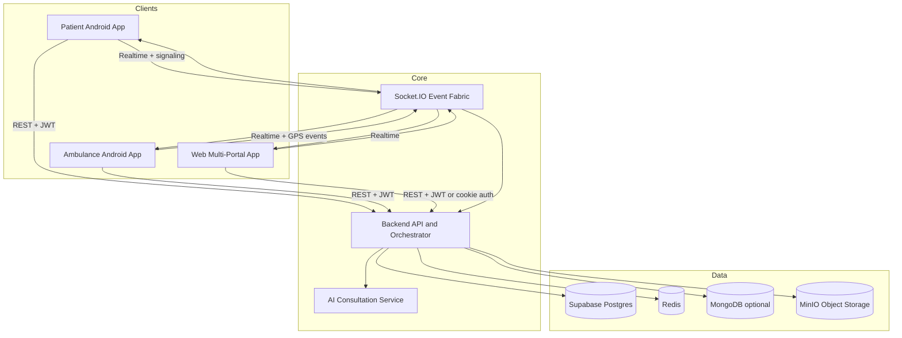

## 4. Operating Principles

- Backend-first truth: all business decisions, approval checks, state transitions, and cross-role coordination happen in the backend.
- Approval-gated visibility: providers are not patient-visible until admin approval is complete.
- Role-based isolation: each role sees only the workflows and data required for its responsibility.
- Realtime-first coordination: appointments, consultations, emergency dispatch, notifications, and some catalog updates propagate over Socket.IO.
- Shared records graph: prescriptions, reports, consultations, vitals, profile data, and health-card QR access all converge on the same patient data model.
- Multichannel continuity: patient app, provider portals, ambulance ops, and admin tooling all observe the same underlying entities.

## 5. Backend Domain Map

The backend route groups define the ecosystem orchestration domains:

| Domain | Route group | Responsibility |
| --- | --- | --- |
| Auth | `routes/auth` | register, login, verify email, refresh, password, profile identity |
| Patient | `routes/patient` | dashboard, profile, prescriptions, reports, discovery-facing patient actions |
| Doctor | `routes/doctor` | schedules, prescriptions, consultation-side doctor workflows |
| Appointment | `routes/appointment` | appointment lifecycle and slot-level booking behavior |
| Consultation | `routes/consultation` | consultation session start, signaling, completion, linked prescriptions |
| Hospital | `routes/hospital` | hospital operations, departments, doctors, emergency coordination |
| Hospital Manager | `routes/hospitalManager` | manager creation and hospital-level delegated operations |
| Clinic | `routes/clinic` | clinic staff, appointments, schedule, consultations |
| Pharmacy | `routes/pharmacy` | prescriptions queue, orders, inventory, pharmacy reports |
| Diagnostic Center | `routes/diagnosticCenter` | bookings, result publication, reporting |
| Ambulance | `routes/ambulance` | SOS dispatch, assignment, status, tracking |
| Medicine | `routes/medicine` | medicine catalog, pharmacy inventory-facing consumption |
| Reports | `routes/report` | report CRUD and file-backed report records |
| Uploads | `routes/uploads` | generic file upload primitives |
| Health Card | `routes/healthCard` | QR token generation, public health-record view |
| Vitals | `routes/vitals` | vitals ingestion and retrieval |
| Notifications | `routes/notifications` | unread counts, device registration, notification actions |
| Admin | `routes/enhancedAdmin` | approvals, provider governance, analytics, audit, compliance |
| Chatbot | `routes/chatbot` | conversational support and AI interaction |

## 6. Client Surface Map

### 6.1 Patient App

The patient Android app covers:

- authentication and verification,
- home dashboard,
- doctor and facility discovery,
- appointment booking,
- consultation join flow,
- records, prescriptions, reports, profile,
- medicine ordering,
- diagnostic booking,
- emergency SOS,
- vitals and reminders,
- QR health card generation.

### 6.2 Ambulance App

The ambulance Android app covers:

- operator and driver login,
- emergency queue,
- assignment acceptance,
- request detail,
- GPS tracking,
- status progression,
- field-response profile and vehicle data.

### 6.3 Web Portals

The web app currently provides dedicated operational portals for:

- admin,
- doctor,
- hospital,
- clinic,
- pharmacy,
- diagnostic center,
- consultation room,
- public health-card page,
- role-specific login and registration pages.

## 7. Canonical Ecosystem Flow

This is the complete system story at one glance.

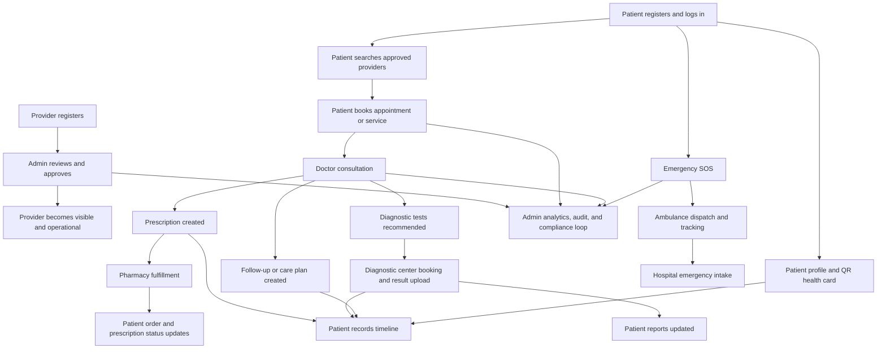

## 8. Identity, Authentication, and Approval

### 8.1 Patient Authentication Flow

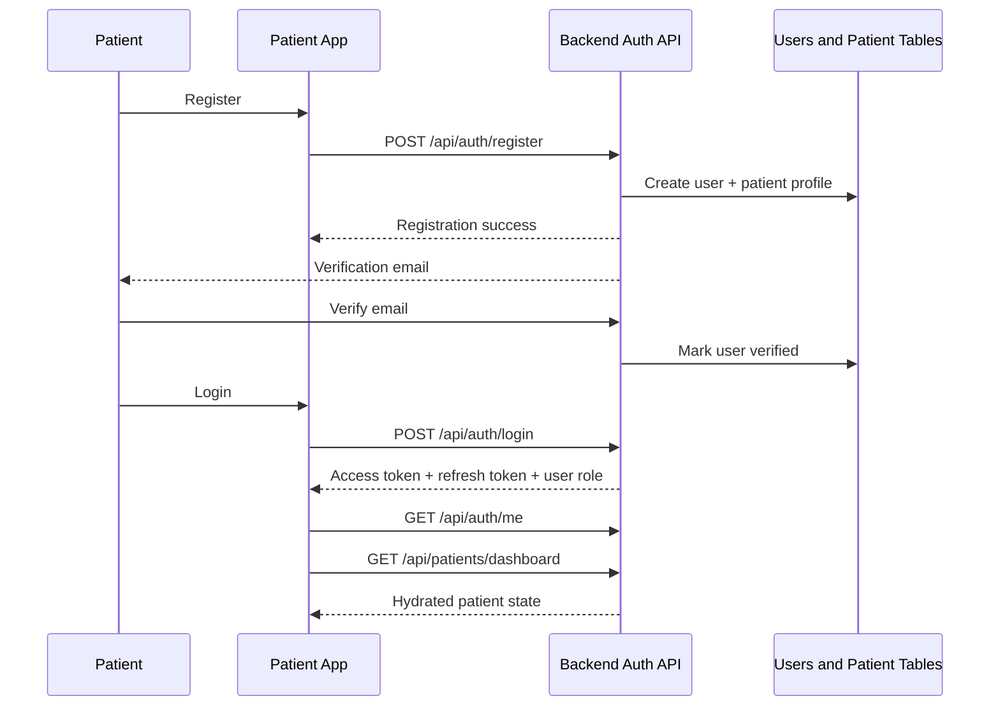

Patient users do not require admin approval. They need valid registration, email verification when applicable, and authenticated session state.

### 8.2 Provider Registration and Approval Flow

This is the most important governance workflow in the system because it determines whether a provider can influence patient-facing care.

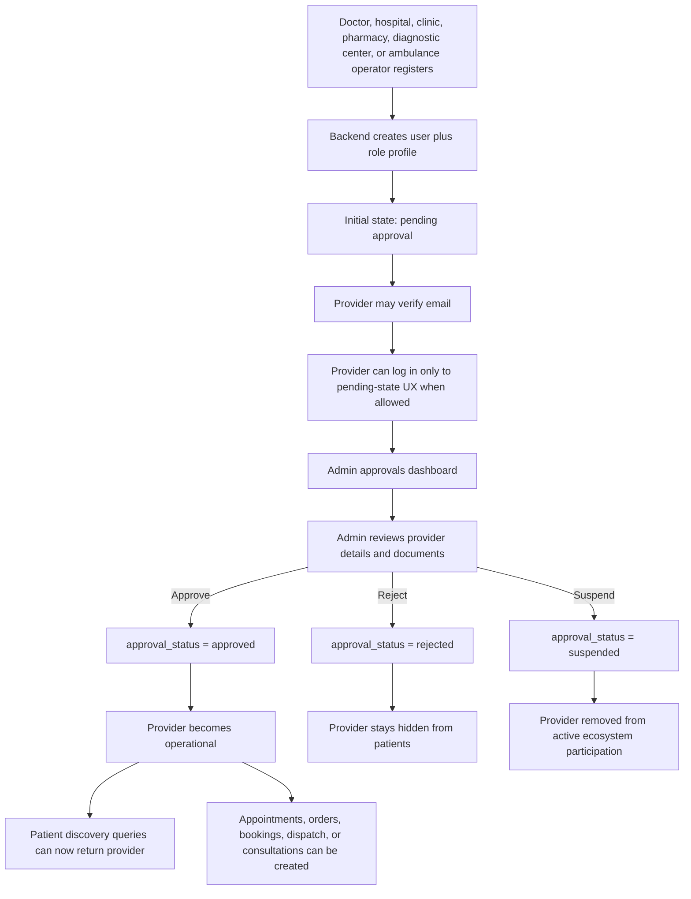

Approval affects:

- patient search visibility,
- appointment booking eligibility,
- facility discoverability,
- pharmacy order routing,
- diagnostic booking availability,
- ambulance participation,
- downstream real-time events and dashboards.

### 8.3 Hospital Manager Delegation Flow

Hospital managers are a delegated operational role tied to a hospital, not an independent public facility.

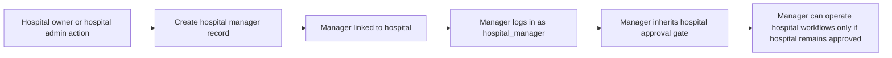

This allows hospitals to distribute operations without creating a second public-facing hospital identity.

## 9. Discovery and Patient Entry Into Care

The patient app is the primary consumer gateway into the ecosystem.

### 9.1 Approved Provider Discovery Flow

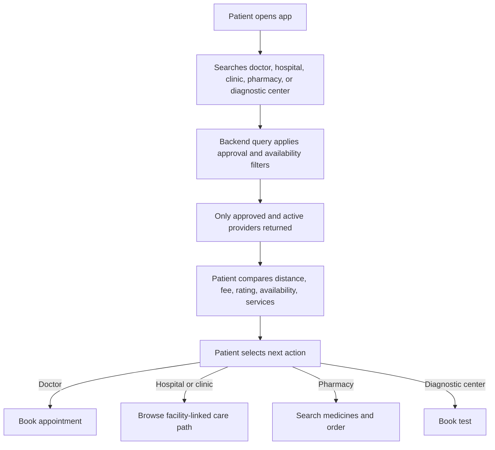

The patient never needs to understand the internal provider approval workflow. They only see operational providers that passed admin governance.

### 9.2 Appointment Booking Flow

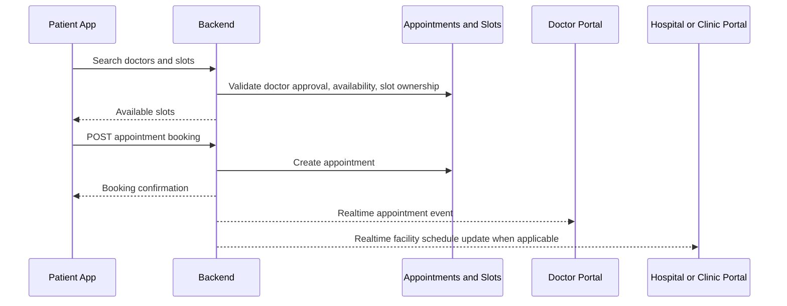

Appointment flow can originate from:

- a standalone doctor,
- a hospital-linked doctor,
- a clinic-linked doctor.

Operationally, the backend normalizes these paths into one appointment model.

## 10. Hospital and Clinic Operational Workflows

Hospitals and clinics are not just search results. They are care-orchestration containers.

### 10.1 Hospital Workflow

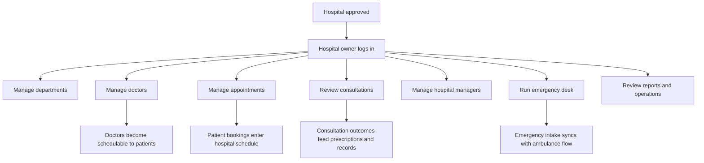

### 10.2 Clinic Workflow

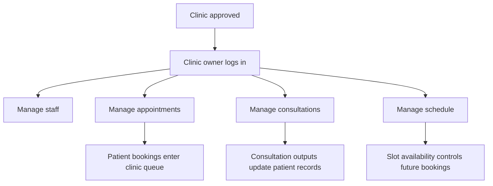

Hospitals and clinics are the facility layer that surrounds doctor delivery. They do not replace the doctor role; they operationalize it.

## 11. Consultation Workflow

Consultation is the clinical core of the ecosystem.

### 11.1 Consultation Lifecycle

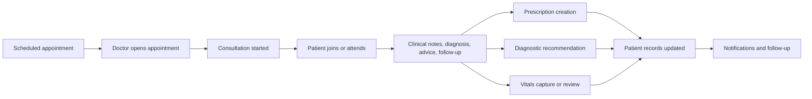

### 11.2 Teleconsultation and Realtime Session Flow

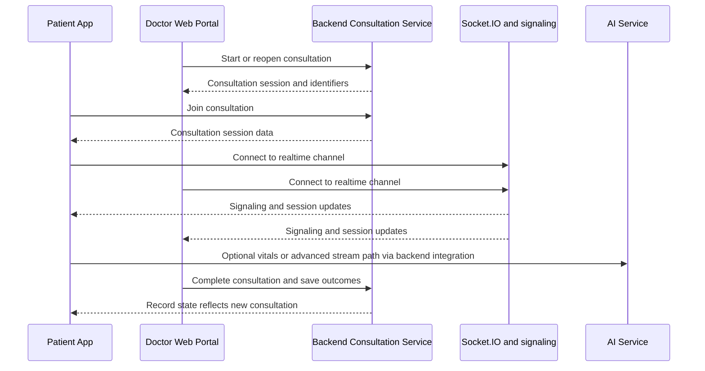

Consultation outputs can directly produce:

- active prescriptions,
- follow-up dates,
- diagnostic requirements,
- doctor notes,
- patient-visible record entries.

## 12. Prescription and Pharmacy Workflow

The prescription flow connects doctor output to pharmacy operations and patient medicine access.

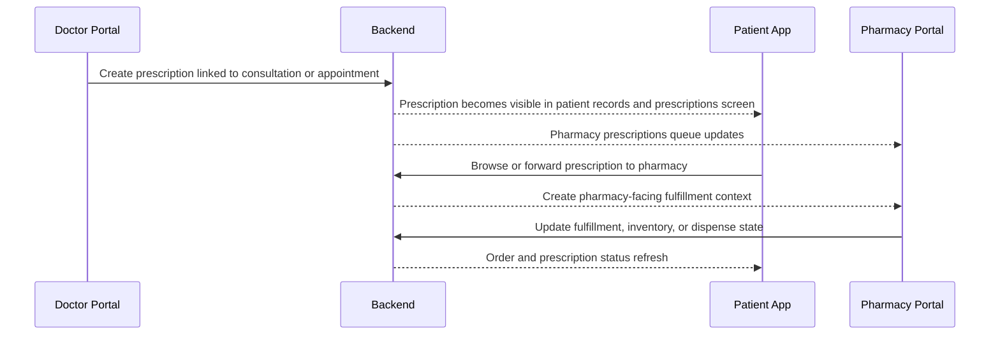

Pharmacy workflow responsibilities include:

- reviewing incoming prescriptions,
- managing inventory,
- managing orders,
- reporting on pharmacy operations,
- reflecting dispense state back to the patient-facing record model.

## 13. Diagnostic Workflow

Diagnostic centers convert consultation intent into structured clinical evidence.

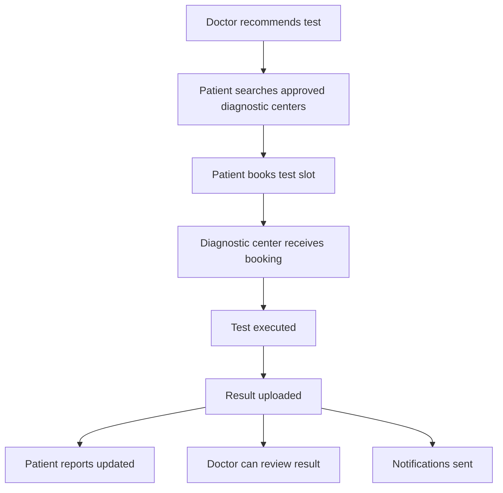

Diagnostic center portal responsibilities include:

- booking intake,
- operational test execution,
- result publication,
- reporting and audit visibility.

Diagnostic results become part of the patient’s longitudinal record set and can later be exposed through the health-card QR path.

## 14. Records, Reports, Profile, and Health Card QR

The records layer is the patient’s longitudinal memory inside the ecosystem.

### 14.1 Record Composition

Patient records are assembled from multiple independent workflows:

- consultation history,
- prescriptions,
- uploaded or generated reports,
- vitals history,
- profile and emergency contacts,
- family members,
- health-card QR access state.

### 14.2 Reports and File-Backed Record Flow

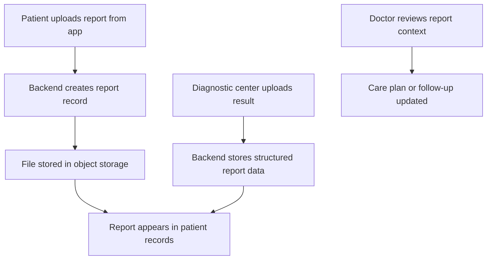

### 14.3 Patient Profile Flow

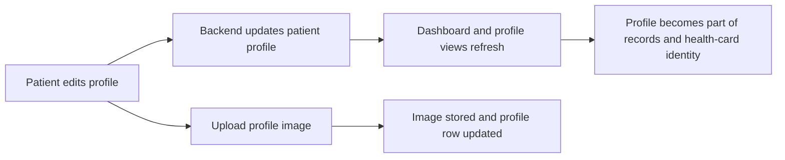

### 14.4 Health Card QR Flow

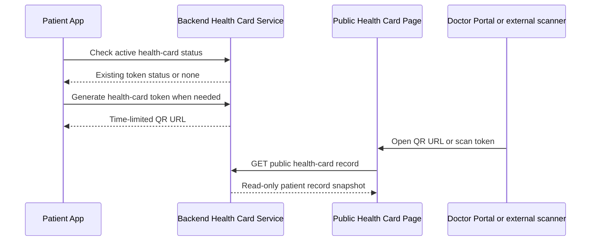

The QR workflow is intentionally read-only and time-limited. It is designed for clinical access, not general account access.

## 15. Emergency and Ambulance Workflow

Emergency handling is the fastest, most real-time workflow in the ecosystem.

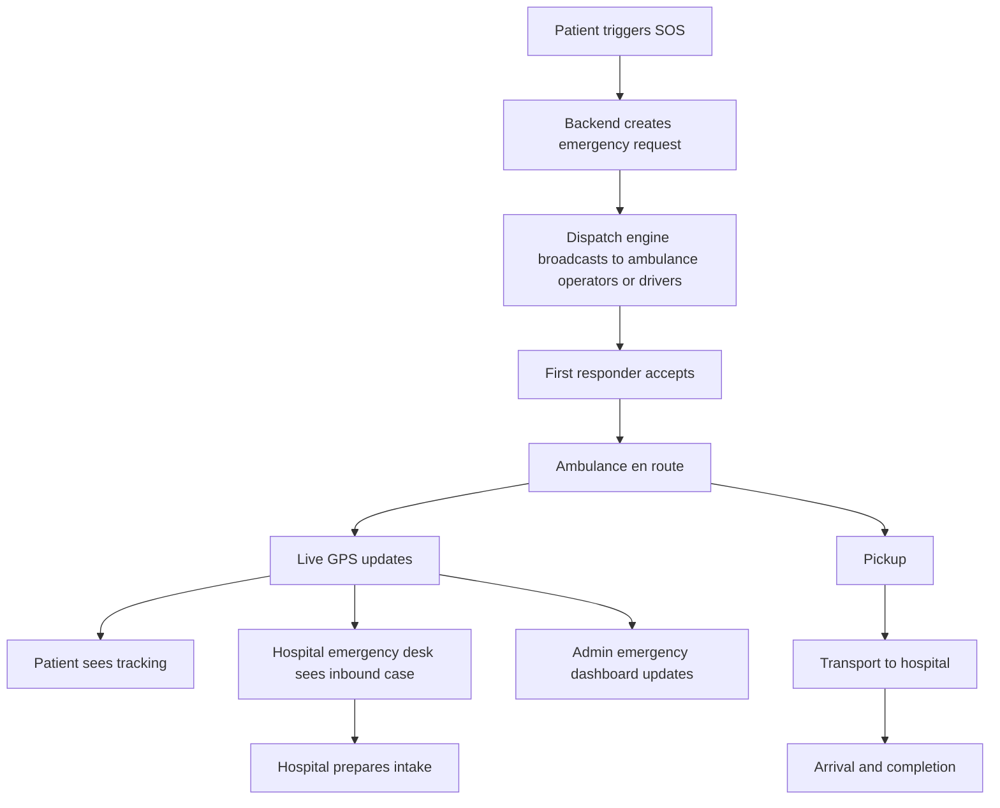

### 15.1 Ambulance App Operational Loop

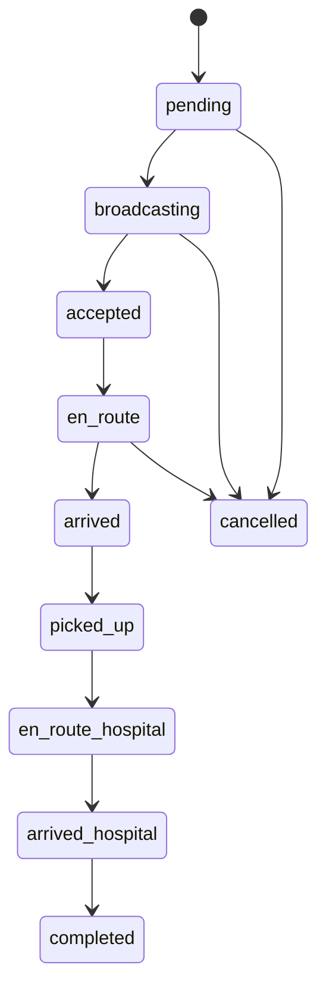

Emergency visibility spans:

- patient app,
- ambulance app,
- hospital emergency desk,
- admin emergencies dashboard.

## 16. Notifications and Realtime Propagation

Realtime coordination is not a side feature. It is how the ecosystem stays synchronized across apps.

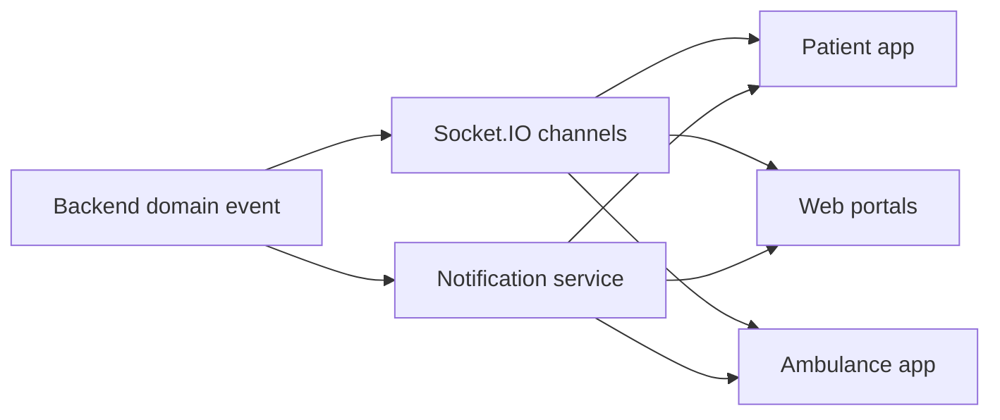

Common realtime categories include:

- appointment created, confirmed, cancelled, rescheduled,
- consultation started or completed,
- prescription created,
- report ready,
- diagnostic booking updates,
- emergency assignment and tracking,
- provider-catalog updates,
- force-logout or session-expiry signals.

## 17. Admin Governance Workflow

Admin is the safety, control, and compliance layer of the ecosystem.

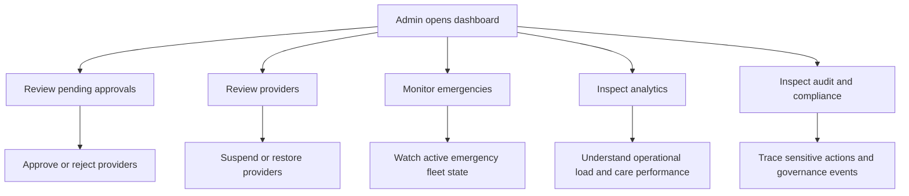

Admin decisions have ecosystem-wide impact:

- provider approval changes patient visibility,
- suspension blocks care workflows,
- emergency monitoring provides live operations oversight,
- audit and compliance establish traceability for sensitive actions.

## 18. AI Service Workflow

The AI service is the advanced reasoning engine used for consultation-adjacent intelligence and vitals interpretation.

```mermaid
flowchart TD
  V1[Vitals stream or structured payload] --> V2[Rule engine evaluates thresholds]
  V2 --> V3[Alerts emitted]
  V3 --> V4[Async AI reasoning worker enriches context]
  V4 --> V5[Clinical reasoning or follow-up suggestions]
  V5 --> V6[Consultation workflow can consume output]
```

The AI service is responsible for:

- vitals rule evaluation,
- structured alert generation,
- possible condition reasoning,
- follow-up prompt generation,
- advanced consultation support.

It is not the primary system of record. The backend remains authoritative for persisted care state.

## 19. Data Ownership and Persistence Model

| Data type | Primary store | Why it exists |
| --- | --- | --- |
| Users, patients, doctors, facilities, appointments, prescriptions, reports, emergencies | Supabase Postgres | Transactional source of truth |
| Token and short-lived coordination state, rate limits, event streams, health-card token cache | Redis | Fast state and realtime coordination |
| Uploaded files, images, reports | MinIO | Object storage for binary assets |
| AI conversation or optional AI-side persistence | MongoDB optional | Flexible AI-oriented storage |

The backend is the canonical write path into these stores.

## 20. Workflow Matrix by Role

| Role | Main entry surface | Primary workflows | Main outputs into ecosystem |
| --- | --- | --- | --- |
| Patient | Android patient app | register, login, search, book, consult, records, pharmacy, diagnostics, SOS, profile, QR | appointments, uploads, medicine orders, emergency requests |
| Doctor | Web doctor portal | schedule, appointments, consultations, prescriptions, patient review, QR scan | diagnoses, advice, prescriptions, consultation records |
| Hospital owner | Web hospital portal | departments, doctors, appointments, consultations, reports, managers, emergency | facility operations and doctor availability |
| Hospital manager | Web hospital portal | delegated hospital operations | hospital coordination under same approval umbrella |
| Clinic owner | Web clinic portal | staff, appointments, consultations, schedules | clinic care operations |
| Pharmacy owner | Web pharmacy portal | prescriptions queue, inventory, orders, reports | fulfillment and dispense updates |
| Diagnostic center owner | Web diagnostic portal | bookings, results, reports | test results and report generation |
| Ambulance operator or driver | Ambulance Android app | accept dispatch, navigate, track, status progression | emergency transport state and live location |
| Admin or super admin | Web admin portal | approvals, suspension, analytics, audit, compliance, emergencies | governance, trust, oversight |

## 21. End-to-End Patient Journey Narrative

One complete patient journey can involve nearly every part of the ecosystem:

1. A patient registers and logs in.
2. The patient searches only approved doctors and facilities.
3. The patient books a doctor appointment.
4. The doctor consults and creates prescription plus diagnostic recommendation.
5. The pharmacy receives the prescription workflow.
6. The diagnostic center receives the testing workflow.
7. Reports and prescriptions flow back into the patient’s records.
8. The patient profile and QR health card now expose a consolidated clinical snapshot.
9. If the patient deteriorates, SOS can trigger ambulance dispatch and hospital intake.
10. Admin can observe approvals, emergencies, and compliance across the entire path.

This is why SWASTIK is best understood as a coordinated care network, not as isolated apps.

## 22. Companion READMEs and Deep-Dive Docs

Product-specific deep dives:

- [Patient App README](app/README.md)
- [Ambulance App README](ambulance-app/README.md)
- [Web App README](swastik-web/README.md)

Existing ecosystem references:

- [COMPLETE_ECOSYSTEM_JOURNEY.md](COMPLETE_ECOSYSTEM_JOURNEY.md)
- [ADMIN_APPROVAL_FLOWCHARTS.md](ADMIN_APPROVAL_FLOWCHARTS.md)

## 23. Summary

SWASTIK is a shared-care ecosystem with five layers working together:

1. Patient access layer.
2. Provider operations layer.
3. Emergency response layer.
4. Admin governance layer.
5. Backend and AI orchestration layer.

Every major workflow in the repository fits into one or more of these loops:

- identity and approval,
- discovery and booking,
- consultation and treatment,
- fulfillment and diagnostics,
- records and longitudinal history,
- emergency dispatch and live coordination,
- governance, analytics, and compliance.

That is the complete ecosystem model this repository implements.
