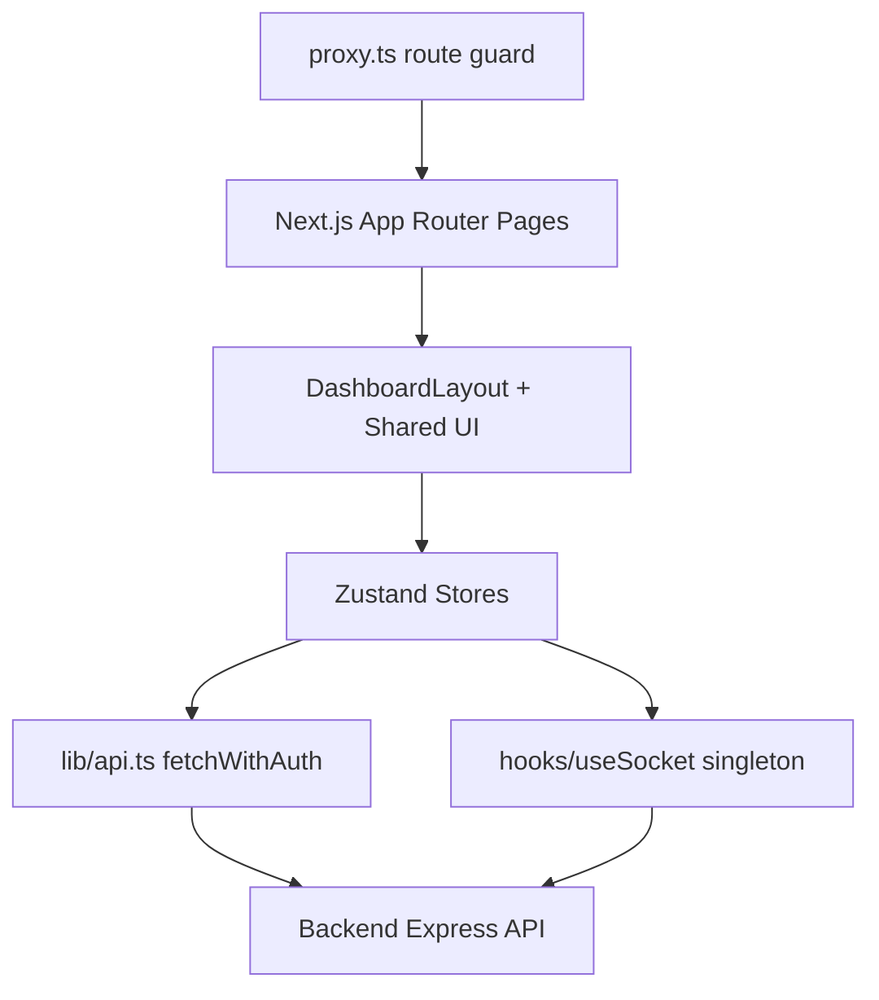
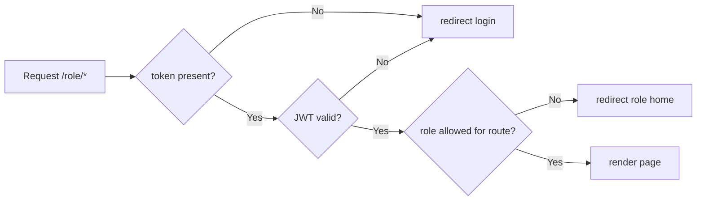
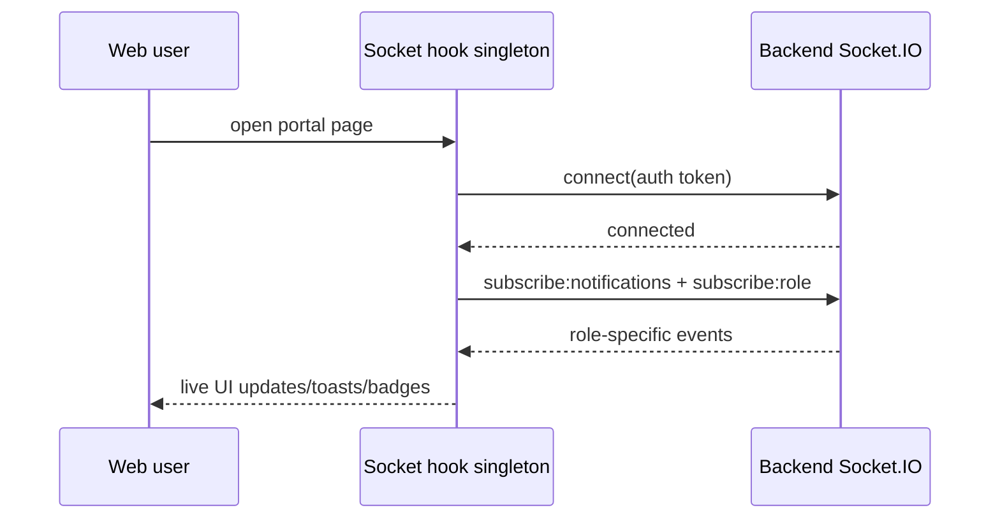
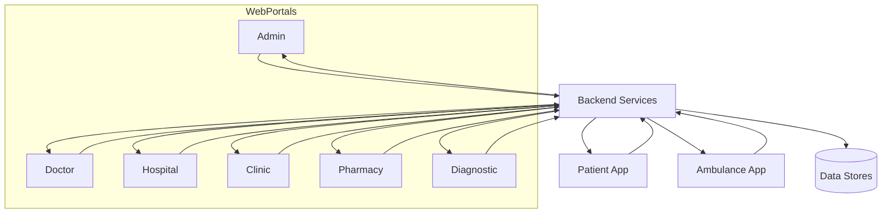

# SWASTIK Web App (Next.js) - Multi-Portal End-to-End README

Last updated: 21 March 2026

## 1) Purpose

The Web App is the role-based operational control layer for the healthcare network.

It serves:

- Admin portal
- Doctor portal
- Hospital portal
- Clinic portal
- Pharmacy portal
- Diagnostic center portal

All portals share unified auth, role guard, API client, Zustand stores, and real-time notifications.

---

## 2) Web Architecture

Core runtime traits:

- Next.js 16 (App Router, Turbopack build).
- Middleware role guard via JWT/cookie verification.
- Shared dashboard shell with theme-per-role.
- Real-time Socket.IO singleton with reconnection and event subscriptions.

---

## 3) Role Portals and Navigation Icons

Navigation is defined in each role layout and rendered by shared DashboardLayout.

## 3.1 Admin Portal (/admin)

- LayoutDashboard -> Dashboard
- ClipboardCheck -> Pending Approvals
- Users -> Providers
- AlertTriangle -> Emergencies
- BarChart3 -> Analytics
- FileCheck -> Compliance
- History -> Audit Trail
- Settings -> Settings

## 3.2 Doctor Portal (/doctor)

- LayoutDashboard -> Dashboard
- Calendar -> Appointments
- Video -> Consultations
- ClipboardList -> Prescriptions
- Users -> Patients
- Activity -> Vitals
- Clock -> Schedule
- Settings -> Settings

## 3.3 Hospital Portal (/hospital)

- LayoutDashboard -> Dashboard
- Building2 -> Departments
- Users -> Doctors
- Calendar -> Appointments
- Stethoscope -> Consultations
- AlertTriangle -> Emergency
- UserCog -> Managers
- BarChart3 -> Reports
- Settings -> Settings

## 3.4 Clinic Portal (/clinic)

- LayoutDashboard -> Dashboard
- Users -> Staff
- Calendar -> Appointments
- Stethoscope -> Consultations
- Clock -> Schedule
- Settings -> Settings

## 3.5 Pharmacy Portal (/pharmacy)

- LayoutDashboard -> Dashboard
- FileText -> Prescriptions
- Package -> Inventory
- ShoppingCart -> Orders (badge enabled)
- BarChart3 -> Reports
- Settings -> Settings

## 3.6 Diagnostic Center Portal (/diagnostic-center)

- LayoutDashboard -> Dashboard
- FlaskConical -> Test Catalog
- CalendarCheck -> Bookings
- FileCheck -> Results
- BarChart3 -> Reports
- Settings -> Settings

---

## 4) Entry and Auth UX Icons

Landing page portal picker icons:

- Shield (Admin)
- Stethoscope (Doctor)
- Building2 (Hospital)
- Building (Clinic)
- Microscope (Diagnostic Center)
- Pill (Pharmacy)
- Heart (brand)

Auth and utility icon patterns:

- Mail, Lock, Eye/EyeOff, ArrowLeft, CheckCircle, Loader2.

Global shell icons:

- Menu/X (mobile nav)
- LogOut (logout)
- Wifi/WifiOff (connection)
- Sun/Moon/Monitor (theme)
- Bell/notification icons

---

## 5) Route Security and Role Guard

Middleware (proxy.ts) enforces:

- token presence,
- token validity/expiry,
- route prefix to allowed role map,
- redirect to role-specific login if invalid,
- cross-role redirection to proper home route.

---

## 6) API Layer, Tokens, and Error Handling

API client behavior (lib/api.ts):

- central fetchWithAuth wrapper,
- module + localStorage token persistence,
- automatic refresh-token retry path on 401,
- safe JSON parsing with user-friendly fallback messages,
- request timeout and abort handling,
- standardized ApiResponse structure.

---

## 7) Real-Time Event Synchronization

useSocket.ts provides:

- singleton socket for all components,
- connect/reconnect lifecycle,
- role/channel subscriptions,
- typed event hooks for notifications, appointments, orders, diagnostics, consultations, and vitals.

---

## 8) End-to-End Cross-Portal Sync Examples

### 8.1 Appointment Lifecycle

Patient books appointment -> doctor portal receives new event -> clinic/hospital schedules update -> admin analytics update.

### 8.2 Emergency Lifecycle

Patient SOS -> ambulance acceptance -> hospital emergency board update -> admin emergency monitor update.

### 8.3 Prescription & Fulfillment

Doctor prescription created -> pharmacy queue update -> order progression events -> patient visibility updates.

### 8.4 Diagnostics

Booking created -> center executes tests -> result upload -> doctor/patient records refresh + notifications.

---

## 9) Shared UI and Experience Model

DashboardLayout provides:

- responsive sidebar + mobile focus trap,
- role-specific theming,
- pending approval gating for provider roles,
- global socket toasts,
- notifications panel,
- theme toggle and connection indicator,
- role-aware user dropdown behavior.

---

## 10) Build and Runtime

- Build command: next build
- Output mode: standalone (Docker-ready)
- Key env vars:
  - NEXT_PUBLIC_API_URL
  - NEXT_PUBLIC_SOCKET_URL
  - NEXT_PUBLIC_AI_WS_URL
  - API_URL_INTERNAL (SSR-internal)

Image optimization supports Supabase, MinIO/S3, and configured remote domains.

---

## 11) Failure Handling and Resilience

- token expiration -> silent refresh; if refresh fails, clean logout.
- socket disconnect -> reconnect with retained subscriptions.
- network/API failures -> user-friendly messages and retry affordances.
- approval pending states -> constrained navigation until approved.

---

## 12) Full Ecosystem Relationship Diagram

---

## 13) Portal-by-Portal Readiness Checklist

For each portal verify:

- login + role guard,
- dashboard API hydration,
- store actions (CRUD/read/list),
- real-time event subscriptions,
- approval-state behavior,
- error state/loading skeleton behavior,
- settings/profile updates.

---

## 14) Product Scope Summary

The web app is SWASTIK’s operational nervous system. It coordinates every provider role, feeds and consumes real-time events, and keeps patient-facing mobile experiences synchronized with institutional workflows from onboarding to emergency and follow-up care.
