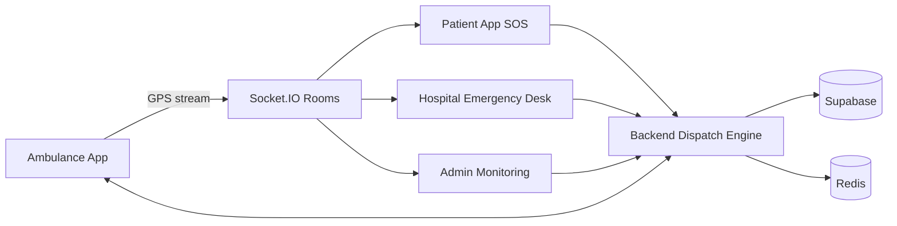
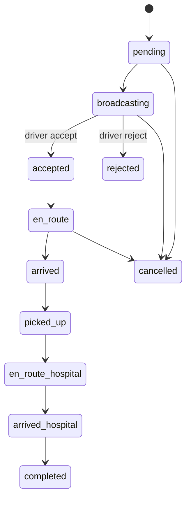
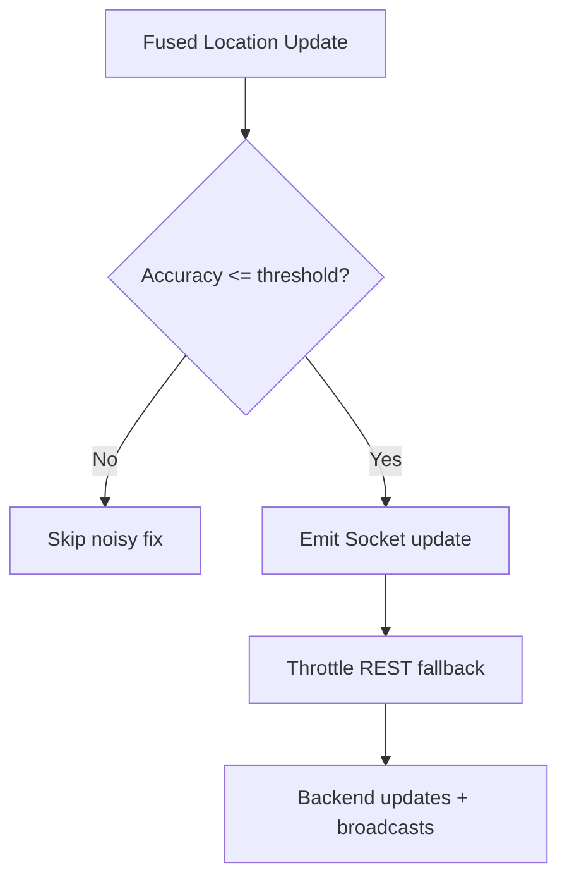

# SWASTIK Ambulance App (Android) - Full Dispatch, Tracking, and Field Ops README

Last updated: 21 March 2026

## 1) Purpose

The Ambulance App is the field-operations client for emergency response teams (ambulance operators/drivers).

It provides:

- secure role-based login,
- dispatch queue and emergency broadcasts,
- first-accept workflow,
- status lifecycle progression,
- continuous foreground GPS streaming,
- patient pickup details and navigation support,
- profile/vehicle selection and operational controls.

---

## 2) System Position in Ecosystem

---

## 3) Navigation Surface

Defined in ambulance-app/src/main/java/com/example/swastik/ambulance/ui/navigation/NavGraph.kt.

Routes:

- login
- register
- dashboard
- emergencies
- profile
- emergency/{requestId}

Notable behavior:

- shared DashboardViewModel across dashboard + emergency list + detail (state coherence),
- session expiry listeners force redirect to login,
- emergency detail route loads request-specific data and live updates.

---

## 4) Dashboard and UI Icon Semantics

### Top Bar Actions

- MyLocation -> start/stop GPS tracking.
- Refresh -> reload dashboard.
- Person -> profile.
- Logout -> secure sign-out.

### Quick Action Cards

- Warning -> emergency queue access.
- MyLocation -> GPS toggle action.

### Emergency Detail Icons

- Warning -> emergency type.
- Flag -> priority.
- BroadcastOnPersonal -> dispatch mode.
- Numbers -> request id.
- Schedule -> created timestamp.
- Person/Badge/Phone/Call -> requester identity + contact.
- LocationOn/MyLocation/Navigation -> pickup geolocation and navigation.
- LocalShipping/Radio -> status update controls.

### Auth/Profile Icons

- LocalShipping, Email, Lock, Visibility, Person, Business, Phone.
- DirectionsCar + CheckCircle/RadioButtonUnchecked for vehicle assignment UX.

---

## 5) Emergency Lifecycle and Dispatch Logic

Backend also supports hospital-controlled assignment flow in parallel to SOS broadcast model.

---

## 6) Real-Time Event Model

Socket manager listens/emits for:

- ambulance:broadcast
- ambulance:request-taken
- ambulance:assigned
- ambulance:status-update
- ambulance:location-update
- patient:location-update
- notification:new
- auth:force-logout

### Tracking room behavior

- On active request, app joins request-specific tracking room.
- Location packets include requestId when available.
- Reconnect logic re-subscribes and replays context.

---

## 7) GPS Streaming Reliability

LocationTrackingService:

- runs as foreground service,
- high-accuracy polling during active emergency,
- lower power mode when idle,
- skips poor-accuracy fixes,
- emits Socket.IO updates first,
- always sends throttled REST fallback updates for persistence.

---

## 8) API Surface Consumed

Key groups:

- /auth/login, /auth/register, /auth/refresh-token, /auth/logout, /auth/me
- /ambulances/dashboard
- /ambulances/vehicles
- /ambulances/history
- /ambulances/request/{id}
- /ambulances/{requestId}/accept
- /ambulances/{requestId}/reject
- /ambulances/request/{requestId}/status
- /ambulances/location

---

## 9) Security and Role Controls

Server-side RBAC enforces role-specific operation rights.

Allowed primary roles:

- ambulance_operator
- ambulance_driver
- admin/super_admin (monitor/support in specific paths)

Invalid/expired sessions trigger forced logout and local session clear.

---

## 10) Permissions and Device Behavior

From AndroidManifest:

- fine/coarse/background location,
- foreground service + location service,
- internet + network state,
- notifications,
- vibration for emergency urgency.

Permission chain in app:

1. foreground location,
2. notifications (Android 13+),
3. background location (Android 10+),
4. start service.

---

## 11) Cross-Platform Synchronization

This app synchronizes with:

- patient app tracking screens,
- hospital emergency desk workflows,
- admin emergency monitoring dashboards.

Consistency guarantees:

- first-accept lock model avoids double assignment,
- status transitions are backend-authoritative,
- reconnect recovery reattaches to dispatch/tracking rooms.

---

## 12) Failure Modes and Handling

- Socket disconnected -> auto reconnect with bounded exponential backoff.
- Socket unavailable -> REST location fallback keeps backend state current.
- Permission denial -> partial functionality with user warnings.
- Session expiry -> forced logout and navigation reset.
- Competing driver accepted request -> local list auto-dismiss via event.

---

## 13) Build and Artifact

- Module: ambulance-app
- Typical debug artifact: ambulance-app/build/outputs/apk/debug/ambulance-app-debug.apk

Backend URL strategy:

- emulator fallback uses http://10.0.2.2:5001/api/
- configurable BuildConfig override for physical device testing.

---

## 14) Operational Readiness Checklist

- login/refresh/logout lifecycle verified,
- emergency accept/reject race validated,
- status progression validated,
- GPS service start/stop + background continuity validated,
- patient tracking parity validated,
- session-expiry behavior validated,
- reconnect and room rejoin validated.

---

## 15) Product Scope Summary

The ambulance app is SWASTIK’s emergency field execution layer. It transforms patient SOS and hospital dispatch intents into measurable, real-time response with lifecycle visibility shared across patient, hospital, and admin ecosystems.
