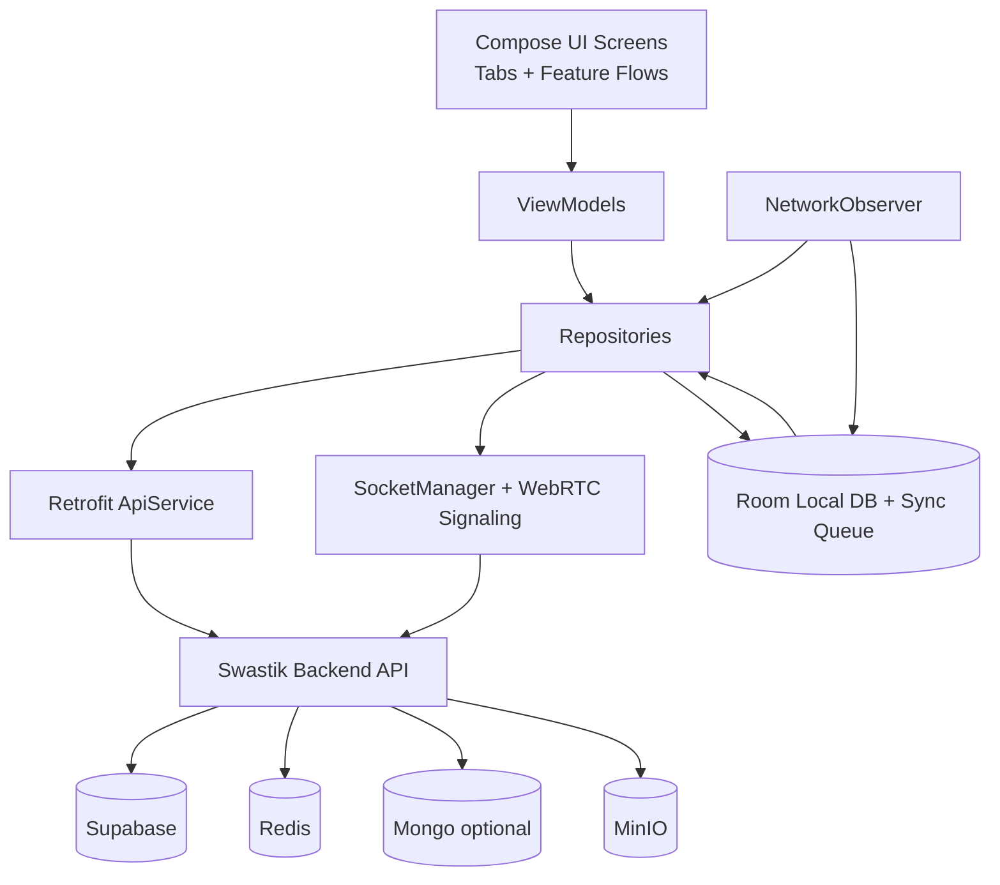
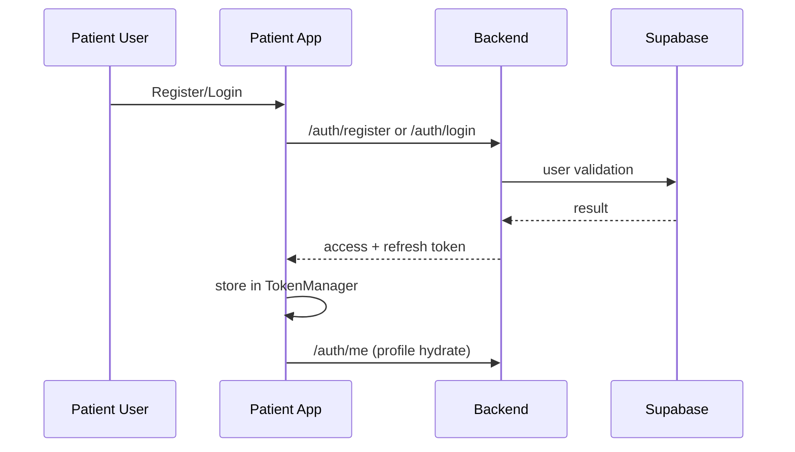
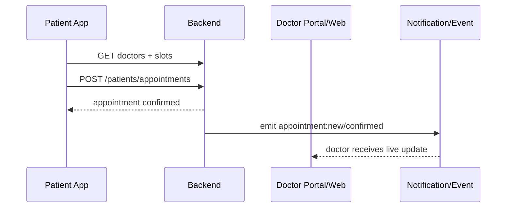
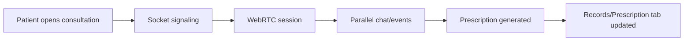
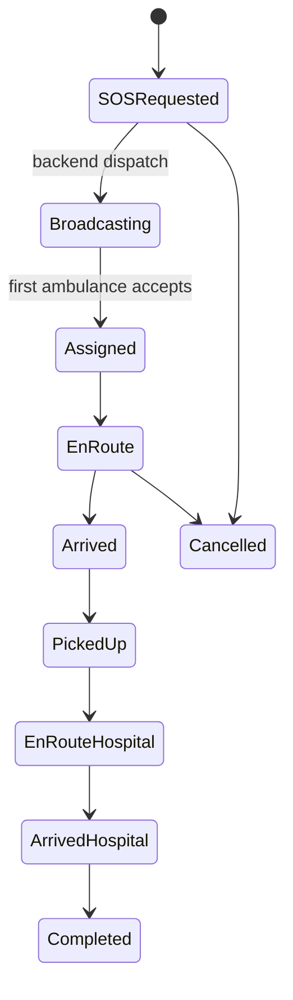
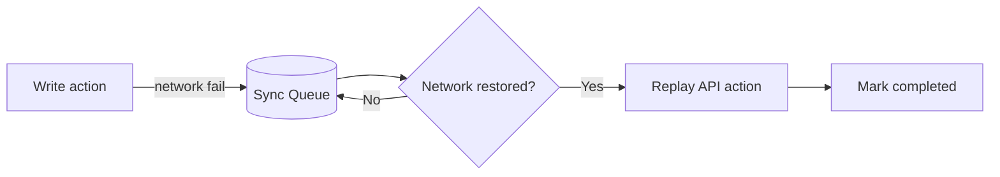

# SWASTIK Patient App (Android) - End-to-End Technical & UX README

Last updated: 21 March 2026

## 1) Purpose

The Patient App is the consumer-facing healthcare super-app for:

- onboarding/authentication,
- doctor discovery and appointment booking,
- tele-consultation,
- emergency SOS with ambulance tracking,
- diagnostics booking,
- medicine ordering,
- reports/prescriptions/vitals and profile management.

It is implemented with Jetpack Compose, Retrofit, WebRTC, Socket.IO, Hilt DI, and local persistence/sync support.

---

## 2) High-Level Architecture

---

## 3) Navigation and UI Surface Map

Primary route definitions are maintained in app/src/main/java/com/example/swastik/navigation/Screen.kt.

### Auth Routes

- home
- patient_register
- patient_login
- email_verification_pending

### Patient Core Routes

- patient_dashboard?tab={0..3}
- appointment_history
- appointment_booking
- medicine_finder
- medicine_detail/{medicineId}
- hospital_finder?type={HOSPITAL|CLINIC|MEDICAL_STORE}
- hospital_detail/{hospitalId}
- video_consultation/{appointmentId}/{doctorName}
- reports
- prescriptions
- chatbot
- emergency
- diagnostic_booking
- vitals_reminders
- medicine_cart
- order_history
- booking_history

---

## 4) Tab Model and Icon Semantics

Bottom navigation (PatientDashboard):

1. Home tab
   - icon: Home (filled/outlined)
   - purpose: summary + quick actions + care directory
2. Medicine tab
   - icon: MedicalServices
   - purpose: medicine search/cart/order
3. Records tab
   - icon: Folder
   - purpose: prescriptions/reports/uploads/history
4. Profile tab
   - icon: Person
   - purpose: profile/settings/contacts/family/logout

Floating center action:

- Add icon -> Book appointment shortcut.

Emergency overlay:

- dedicated SOS emergency action button for immediate escalation.

---

## 5) Home UI Icon Dictionary (Operational Meaning)

Representative icon mapping used across Home and connected patient flows:

- DirectionsCar -> emergency/ambulance action.
- MonitorHeart -> vitals tracking/reminders.
- Receipt -> prescriptions.
- HelpOutline -> chatbot/help assistance.
- ShoppingBag -> medicine order history.
- Science -> diagnostic tests/history.
- LocalHospital -> hospitals.
- MedicalServices -> clinics/care.
- LocalPharmacy / Medication -> pharmacy and medicines.
- Notifications -> alerts panel.
- CloudUpload / AttachFile -> reports upload.
- CalendarMonth / AccessTime / Schedule -> booking date/time metadata.
- CheckCircle / Circle -> completion state toggles.

Auth & safety icons:

- Email, Lock, Visibility/VisibilityOff, ArrowBack, Error.

Consultation icons:

- Mic/MicOff, CallEnd, Cameraswitch, VolumeUp/VolumeOff, Send, VideocamOff.

Facility browsing icons:

- MyLocation, Map/Place, Directions, Call, Star, FilterList, Tune, Warning.

---

## 6) End-to-End Core Flows

### 6.1 Registration/Login/Verification

### 6.2 Appointment Booking

### 6.3 Tele-Consultation

### 6.4 Emergency SOS with Live Tracking

### 6.5 Diagnostics + Reports

Patient searches centers -> books tests -> center uploads result -> patient gets event notification -> report visible in Records.

### 6.6 Medicine Ordering

Patient searches medicines/pharmacies -> cart -> order -> status updates (placed/shipped/delivered/cancelled).

---

## 7) Data Contracts and API Domains

Major API groups consumed by app:

- auth
- patients
- doctors
- appointments
- hospitals/clinics/pharmacy/diagnostic-centers
- ambulances
- medicines
- chatbot
- vitals
- reports/uploads

All calls are via Retrofit ApiService with DTO models and response wrappers.

---

## 8) Real-Time Sync Model

Socket and event classes include notifications, appointment updates, consultation lifecycle, order updates, diagnostic updates, and ambulance tracking.

### Sync Guarantees

- optimistic UI where valid,
- server-authoritative status transitions,
- token refresh + authenticated socket reconnect,
- live event subscription per user/role rooms.

---

## 9) Offline & Reliability

The app includes a persistent write queue and replay manager:

- failed mutable operations are enqueued,
- queue re-drains when network is restored,
- retry bounded with max retry count,
- in-progress stale actions recovered after restart.

This is managed by SyncManager + Room DAO + NetworkObserver.

---

## 10) Permissions and Platform Integrations

From AndroidManifest:

- Internet
- Fine/Coarse location
- Camera + record audio (video consultation)
- Post notifications
- Foreground service + location service permissions
- Deep links: swastik:// and https://swastik.health

Integrations:

- deep-link guarded auth routing,
- geolocation/maps,
- WebRTC media stack,
- file provider for upload/share.

---

## 11) Cross-Platform Sync with Web + Ambulance

The patient app is synchronized with:

- web role dashboards (doctor/hospital/clinic/admin/pharmacy/diagnostic),
- ambulance operator flows,
- backend event bus.

Examples:

- Doctor accepts/schedules consultation -> patient gets live notification.
- Ambulance driver location push -> patient map updates in near real-time.
- Diagnostic result upload on web -> appears in patient records without manual refresh.

---

## 12) Error Conditions and UX Behavior

- Session/token expired -> re-auth flow.
- Network unavailable -> offline banner + queued writes.
- Permission denied -> guided fallback (limited features).
- API timeout -> retry-safe error messaging.
- Inconsistent backend state -> page-level error + refresh action.

---

## 13) Build, Run, and Delivery

- Module: app
- Typical artifact: app/build/outputs/apk/debug/app-debug.apk
- Backend URL strategy:
  - emulator fallback: http://10.0.2.2:5001/api/
  - configurable via BuildConfig/local properties for physical devices.

---

## 14) Operational Checklist

Before release:

- auth + refresh token checks
- consultation media permissions checks
- emergency flow state transition validation
- diagnostics + reports upload/visibility validation
- medicine order status event validation
- offline queue replay validation
- deep link + role guard validation

---

## 15) Product Scope Summary

The patient app is the longitudinal patient journey surface of SWASTIK. It connects routine care, emergency care, telemedicine, pharmacy, diagnostics, and records into one synchronized, event-driven mobile experience.
